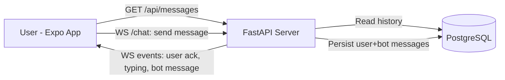

# Dr. Squiggles Chat - Full Stack Challenge

A monorepo prototype of a real-time Crohn's support chat app.

- Client: Expo React Native app in [client](client)
- Server: FastAPI + Prisma in [server](server)
- Persistence: PostgreSQL (Docker)
- Transport split: REST for bootstrap history, WebSocket for live chat

## System Diagram



## Architectural Decisions

- REST endpoint [server/app/main.py](server/app/main.py) `/api/messages` loads full session history.
- WebSocket endpoint [server/app/main.py](server/app/main.py) `/chat` handles live messaging.
- Message persistence and event flow live in [server/app/ws.py](server/app/ws.py).
- Prisma schema in [server/prisma/schema.prisma](server/prisma/schema.prisma) stores messages with role and timestamp.
- On each user message, server persists user record, emits typing, generates bot response, persists bot record, then sends bot event.
- Chat history fetch completes first in [client/hooks/useChatHistory.ts](client/hooks/useChatHistory.ts).
- WebSocket connection is enabled only after history bootstrap in [client/hooks/useChat.ts](client/hooks/useChat.ts).
- Root [docker-compose.yml](docker-compose.yml) starts both API and PostgreSQL.
- Server startup performs `prisma db push` to ensure schema exists in fresh environments.

## Chatbot Persona

Bot logic lives in [server/app/bot.py](server/app/bot.py) as rule-based responses.

Persona constraints:
- Character: Dr. Squiggles, overly enthusiastic goldfish
- Scope: Crohn's-related support only (symptoms, side effects, dosing, injections, flares)
- Non-derailing: out-of-scope prompts are redirected back to Crohn's topics
- Safety: urgent symptom language is escalated to immediate care advice

Implementation approach:
- Keyword matching via `_contains_any(...)`
- Topic-specific response templates in a consistent fish-themed tone
- Simulated thinking delay for better typing-indicator UX

## Setup and Run Instructions

## Prerequisites

- Docker + Docker Compose
- Node.js 20+
- npm

## 1) Start backend + database

From repository root:

```bash
docker compose up --build
```

Services:
- API: http://localhost:8000
- Health: http://localhost:8000/health
- Postgres: localhost:5432

## 2) Start Expo client

In a second terminal:

```bash
cd client
npm install
npm run ios # for ios
# npm run android # for android
# npm run web # for browser
```

The client expects backend URL from `EXPO_PUBLIC_API_URL`, defaulting to `http://localhost:8000`.

Optional override:

```bash
EXPO_PUBLIC_API_URL=http://localhost:8000 npm run web
```

## 3) Verify the flow

1. App loads existing history from `/api/messages`.
2. App opens WebSocket to `/chat`.
3. Sending a message yields: user ack -> typing event -> bot reply.
4. Refreshing app shows persisted conversation history.

## Security Notes

Current CORS in [server/app/main.py](server/app/main.py) allows any origin.

For production, implement stricter origin policy and authenticated WebSocket sessions.

## Repository Notes

- Original assignment is preserved in [CHALLENGE.md](CHALLENGE.md).
